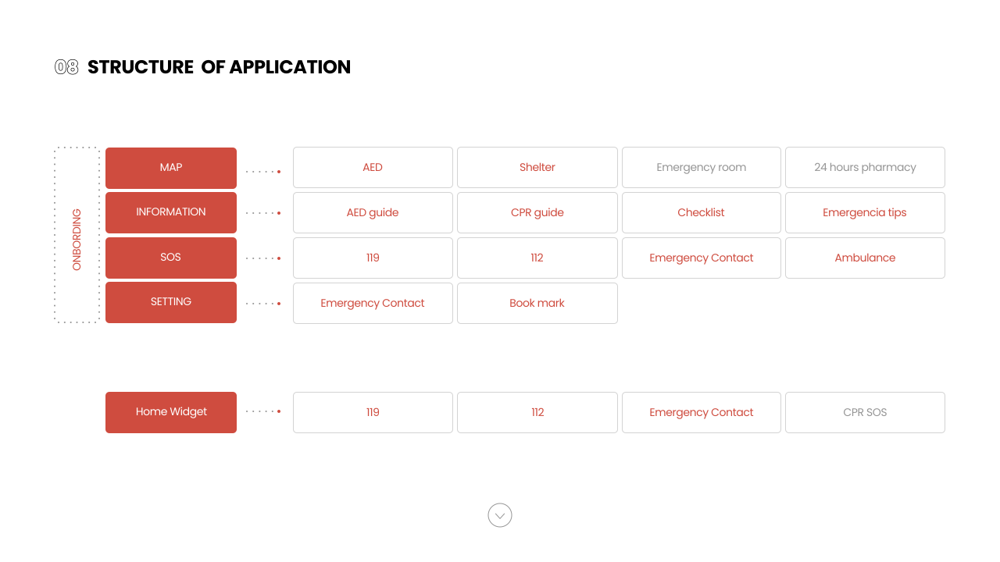
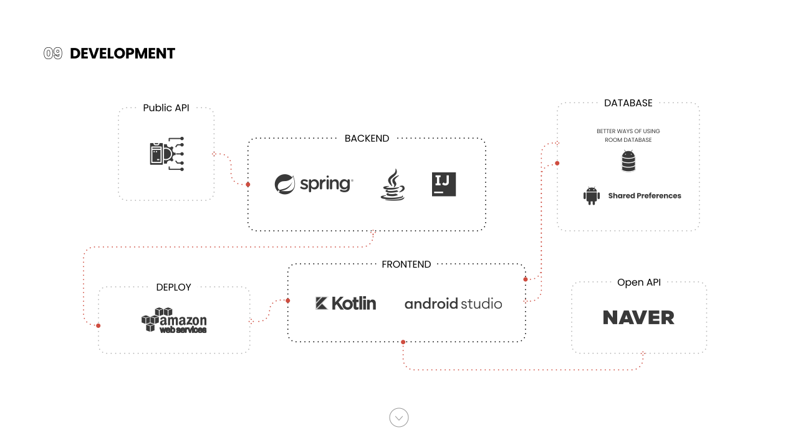

### 1. 프로젝트 개요

> 관심은 있지만, 바빠서 흔히 일어날 수 있는 응급상황에 능동적으로 대처하고 있지 못한 현대인들을 위해 응급 상황을 사전에 대비할 수 있게 도와주고 실제 돌발 상황이 발생했을때 실시간으로 행동지침을 내려주는 앱

_프로젝트 기간 - 2021.03 ~ 2021.05_  
_팀원 - 김유진, 노유리, 임윤지, 권혜민, 조아현_

### 2. 개발 환경

**Language** - Kotlin, Java  
**Development Tool** - Intellij IDEA, Android Studio  
**Server Web Framework** - SpringBoot  
**Version Control** : git & github  
**Cooperation tool** : Slack, Notion

### 3. 내가 맡은 부분

- AED(심장 제세동기), 응급실, 대피소 API
- MAP

---

## Source

- 최종 ppt -
  [<https://www.figma.com/proto/fZHUZA8XRA8vH9T50yIwCh/intime(%EC%9A%B0%EB%A6%AC-%EC%9E%91%EC%97%85%EC%9A%A9)?page-id=1365%3A22800&node-id=1365%3A22801&viewport=1120%2C-4606%2C0.2814231812953949&scaling=min-zoom>](<https://www.figma.com/proto/fZHUZA8XRA8vH9T50yIwCh/intime(%EC%9A%B0%EB%A6%AC-%EC%9E%91%EC%97%85%EC%9A%A9)?page-id=1365%3A22800&node-id=1365%3A22801&viewport=1120%2C-4606%2C0.2814231812953949&scaling=min-zoom>)

- github - [<https://github.com/MPSeven/Intime.git>](https://github.com/MPSeven/Intime.git)
